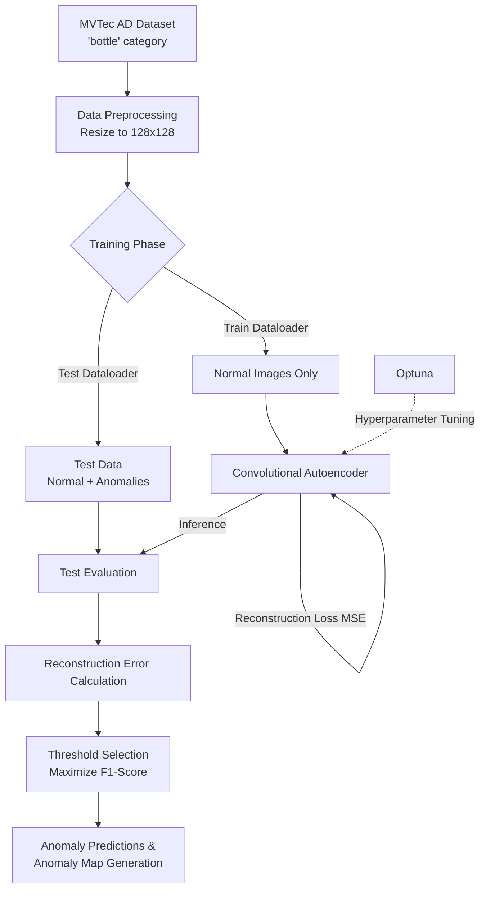

# Anomaly Detection with Convolutional Autoencoders - MVTec AD

This project demonstrates a comprehensive approach to anomaly detection using the **MVTec AD** dataset, focusing specifically on the `bottle` category. MVTec AD is the industry-standard benchmark for anomaly detection in images, simulating realistic industrial scenarios where the model is trained exclusively on normal (defect-free) images.

## Project Overview

The main objective of this project is to accurately detect and localize subtle defects (e.g., scratches, holes, contaminations) on bottles. We approach this using a PyTorch-based Convolutional Autoencoder (CAE) and compare its performance against several traditional machine learning baseline methods.

### Key Features:

- **Realistic Scenario:** Trained only on normal images.
- **Realistic Anomalies:** Detects subtle, localized manufacturing defects.
- **Hyperparameter Optimization:** Utilizes [Optuna](https://optuna.org/) to find the best configuration (learning rate, network capacity, batch size, weight decay) based on the ROC-AUC score.
- **Baseline Comparison:** Benchmarks the CAE against scikit-learn models including PCA Reconstruction, Isolation Forest, One-Class SVM, Local Outlier Factor (LOF), and Elliptic Envelope.

## System Architecture

### 1. Overall Workflow Pipeline

### 2. Convolutional Autoencoder (CAE) Architecture

The CAE preserves the spatial structure of the images, which is essential for identifying the precise location of anomalies via pixel-wise reconstruction errors.

```mermaid
graph LR
    subgraph Encoder
    In(Input<br/>3x128x128) --> C1(Conv2d + BN + LeakyReLU<br/>stride=2)
    C1 --> C2(Conv2d + BN + LeakyReLU<br/>stride=2)
    C2 --> C3(Conv2d + BN + LeakyReLU<br/>stride=2)
    C3 --> C4(Conv2d + BN + LeakyReLU<br/>stride=2)
    end

    subgraph Bottleneck
    C4 --> Bot(Latent Space<br/>Channels * 8)
    end

    subgraph Decoder
    Bot --> D1(ConvTrans2d + BN + ReLU<br/>stride=2)
    D1 --> D2(ConvTrans2d + BN + ReLU<br/>stride=2)
    D2 --> D3(ConvTrans2d + BN + ReLU<br/>stride=2)
    D3 --> D4(ConvTrans2d + Sigmoid<br/>stride=2)
    D4 --> Out(Reconstructed Image<br/>3x128x128)
    end
```

## Notebook Structure Summary

1. **Part 1: Anomaly Detection with CAE**
   - Loads the local MVTec AD (`bottle`) dataset.
   - Defines the Convolutional Autoencoder architecture using PyTorch.
   - Trains the model with Early Stopping based on Validation MSE loss.
   - Evaluates on the test set, computing an optimal threshold that maximizes the F1-Score via grid search over reconstruction errors.
   - Visualizes evaluation metrics (Loss curves, Error distributions, ROC Curves, Confusion Matrices).
   - Generates and plots spatial "Anomaly Heatmaps" displaying the absolute pixel differences between the original and reconstructed images.

2. **Part 2: Hyperparameter Tuning with Optuna**
   - Automates the optimization of model architecture and training hyperparameters (`learning rate`, `base_channels`, `batch_size`, and `weight_decay`).
   - Runs shorter trials targeting the maximum ROC-AUC score, which evaluates the model's overall ranking ability irrespective of specific thresholds.

3. **Part 3: Baseline Method Comparisons**
   - Prepares feature representations by resizing images to 32x32, flattening them, and applying PCA to compress down to 50 principal components.
   - Evaluates statistical and classical ML approaches on these features:
     - PCA Reconstruction Error
     - Isolation Forest
     - One-Class SVM (RBF kernel)
     - Elliptic Envelope
     - Local Outlier Factor (LOF)
   - Visually benchmarks performance with Bar charts, Precision vs Recall plots, and a final scoring Heatmap to declare the best functioning model.

## Results & Conclusions

- The **Convolutional Autoencoder** significantly outperforms traditional ML baselines, providing not just binary classification (Normal vs Anomaly) but also interpretable spatial anomaly maps showing exactly _where_ the defect is located.
- **Optuna Tuning** efficiently discovers the best combination of network capacity constraints and learning rates.
- **Baseline Models:** While computationally cheaper, PCA combined with Isolation Forest or One-Class SVM struggle to understand complex spatial patterns and subtler defects compared to the CAE.

### Recommendations for Production

- **Use CAE** for robust defect localization and obtaining the highest ROC-AUC/F1 metrics.
- Consider exploring more advanced state-of-the-art approaches like PatchCore or Variational Autoencoders (VAEs), and integration of Structural Similarity (SSIM) loss for further defect resolution.
