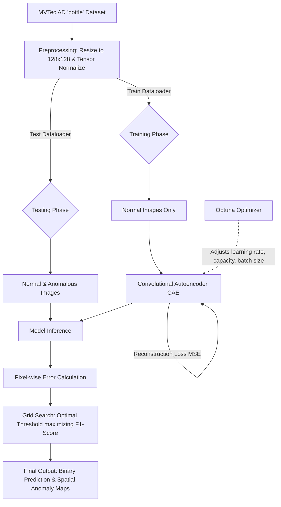
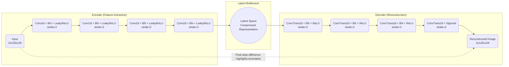

# Anomaly Detection with Convolutional Autoencoders - MVTec AD

This project presents a complete, end-to-end framework for industrial anomaly detection using the **MVTec AD** dataset (focusing on the `bottle` category). Unlike standard academic datasets (e.g., Fashion MNIST), MVTec AD provides a highly realistic and challenging scenario: models must learn to identify subtle, localized manufacturing defects (like scratches, tiny holes, or liquid contamination) while being trained **exclusively on defect-free (normal) images**.

## Why this approach?

In real-world manufacturing, collecting thousands of examples of every possible defect is impossible. The system must operate under an Unsupervised/Semi-Supervised paradigm.

1. We train a **Convolutional Autoencoder (CAE)** strictly on normal images.
2. The CAE learns to compress and reconstruct the visual traits of a "perfect" bottle.
3. During inference, when presented with a defective bottle, the CAE struggles to reconstruct the anomaly.
4. By comparing the input to the reconstruction, we can extract an **Anomaly Heatmap** (based on the Mean Squared Error of the pixels) and classify the image based on a computed threshold.

---

## 🏗️ System Architecture & Workflow

### 1. Overall Pipeline

The lifecycle of the project revolves around data loading, training a reconstruction model, calculating reconstruction errors, and performing automated hyperparameter tuning.

### 2. Convolutional Autoencoder (CAE) Architecture

To preserve spatial context, our network is fully convolutional, avoiding flattening layers that destroy spatial relationships. The bottleneck forces the model to learn the most essential underlying structural features.

---

## 🔍 Detailed Methodology

### Part 1: Convolutional Autoencoder (CAE)

- **Data Preparation**: Images are rescaled to 128x128. Training relies strictly on defect-free samples.
- **Model Training**: Trained using Adam Optimizer and `ReduceLROnPlateau` scheduler. We track Validation MSE Loss and apply _Early Stopping_ to prevent overfitting.
- **Evaluation & Thresholding**: For every image, we calculate the MSE between the original and reconstructed output. A grid-search computes an optimal decision boundary (threshold) that maximizes the F1-Score.
- **Explainability (Visualizations)**:
  - _Placeholder: ``_
  - Creates heatmap overlays demonstrating exactly _where_ the model identifies the flaw by mapping pixel-level deviations.

### Part 2: Hyperparameter Tuning with Optuna

- Instead of relying on manual guessing, we utilize **Optuna** to optimize:
  - `learning_rate` (1e-4 to 1e-2)
  - `base_channels` (16, 32, 48 - dictates network width)
  - `batch_size` (8, 16, 32)
  - `weight_decay` (regularization penalty)
- **Objective**: Maximize the ROC-AUC score, which measures the model's ability to rank anomalies higher than normal distributions irrespective of the decision threshold.
  - _Placeholder: ``_

### Part 3: Classical ML Baselines Comparison

To ensure deep learning is justified, the CAE is rigorously benched against statistical baselines:

1. Feature Extraction: Images are downscaled to 32x32, flattened, and reduced down to 50 dimensions using **PCA**.
2. Evaluated Models:
   - **Isolation Forest**: Isolates anomalies through random data partitioning.
   - **One-Class SVM (OCSVM)**: Learns a decision boundary encapsulating the normal data.
   - **Elliptic Envelope**: Assumes normal data is Gaussian and detects outliers.
   - **Local Outlier Factor (LOF)**: Detects local deviations with respect to neighbors.
   - **PCA Reconstruction Error**.

- _Placeholder: ``_

---

## 📊 Conclusions & Results

- **CAE Superiority**: The Convolutional Autoencoder significantly outperforms traditional baselines. Classical ML methods (like Isolation Forest and OCSVM on PCA features) struggle to comprehend complex structural patterns, often resulting in lower Precision and Recall.
- **Interpretability**: The strongest advantage of the CAE is its spatial outputs. While traditional models just output a raw binary score (Anomaly vs. Normal), the CAE outputs accurate heatmaps isolating the physical anomaly location.
- **Future Improvements**:
  - Implementation of **SSIM (Structural Similarity Index)** loss instead of pure MSE to better handle natural luminance variations.
  - Advancing to state-of-the-art representation-based methods like **PatchCore** or generative frameworks like Variational Autoencoders (VAEs).
